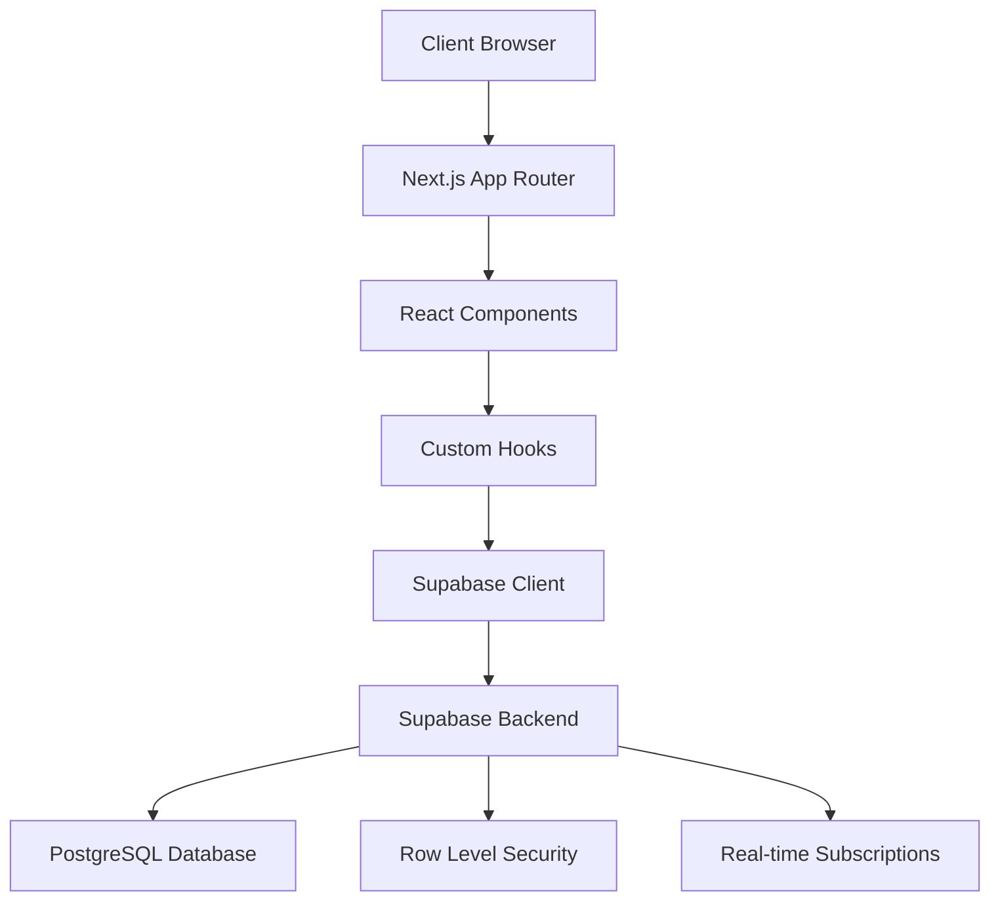

# Design Document

## Overview

The enhanced To-Do List application builds upon the existing foundation to provide advanced productivity features including search, bulk operations, theming, keyboard shortcuts, performance optimizations, import/export, offline support, and analytics. The application maintains its modern web architecture while adding sophisticated capabilities for power users and improved accessibility.

### Technology Stack

- **Frontend Framework**: Next.js 14 (App Router)
- **Language**: TypeScript
- **Styling**: Tailwind CSS
- **UI Components**: shadcn/ui
- **Icons**: Lucide React
- **Backend**: Supabase (Database, Authentication, Real-time)
- **State Management**: React Context + useReducer for complex state
- **Form Handling**: React Hook Form with Zod validation
- **Date Handling**: date-fns

## Architecture

### High-Level Architecture



### Application Structure

```
src/
├── app/                    # Next.js App Router pages
│   ├── (auth)/            # Authentication routes
│   │   ├── login/
│   │   └── register/
│   ├── dashboard/         # Main application
│   ├── globals.css        # Global styles
│   └── layout.tsx         # Root layout
├── components/            # Reusable UI components
│   ├── ui/               # shadcn/ui components
│   ├── auth/             # Authentication components
│   ├── lists/            # List management components
│   ├── tasks/            # Task management components
│   └── layout/           # Layout components
├── lib/                  # Utility functions and configurations
│   ├── supabase/         # Supabase client and types
│   ├── utils.ts          # General utilities
│   └── validations.ts    # Zod schemas
├── hooks/                # Custom React hooks
├── types/                # TypeScript type definitions
└── contexts/             # React contexts
```

## Components and Interfaces

### Core Components

#### Authentication Components
- `LoginForm`: Handles user login with email/password
- `RegisterForm`: Handles user registration
- `AuthGuard`: Protects routes requiring authentication
- `AuthProvider`: Manages authentication state globally

#### List Management Components
- `ListCard`: Displays individual list with task count and actions
- `ListForm`: Form for creating/editing lists
- `ListGrid`: Grid layout for displaying multiple lists
- `DeleteListDialog`: Confirmation dialog for list deletion

#### Task Management Components
- `TaskItem`: Individual task display with checkbox, content, and actions
- `TaskForm`: Form for creating/editing tasks with due date and priority
- `TaskList`: Container for displaying filtered/sorted tasks
- `TaskFilters`: Filter controls for status, priority, and date
- `TaskSort`: Sort controls for various criteria

#### Layout Components
- `Header`: Application header with navigation and user menu
- `Sidebar`: Navigation sidebar (desktop)
- `MobileNav`: Mobile navigation drawer
- `LoadingSpinner`: Consistent loading indicator

### Data Interfaces

#### User Interface
```typescript
interface User {
  id: string;
  email: string;
  created_at: string;
  updated_at: string;
}
```

#### List Interface
```typescript
interface List {
  id: string;
  user_id: string;
  name: string;
  description?: string;
  created_at: string;
  updated_at: string;
  task_count?: number;
}
```

#### Task Interface
```typescript
interface Task {
  id: string;
  list_id: string;
  user_id: string;
  title: string;
  description?: string;
  completed: boolean;
  priority: 'low' | 'medium' | 'high';
  due_date?: string;
  created_at: string;
  updated_at: string;
}
```

#### Filter and Sort Interfaces
```typescript
interface TaskFilters {
  status?: 'all' | 'completed' | 'incomplete';
  priority?: 'low' | 'medium' | 'high' | 'all';
  overdue?: boolean;
}

interface TaskSort {
  field: 'created_at' | 'due_date' | 'priority' | 'title';
  direction: 'asc' | 'desc';
}
```

## Data Models

### Database Schema

#### Users Table (Managed by Supabase Auth)
```sql
-- Supabase handles user authentication
-- Additional user profile data can be stored in a profiles table if needed
```

#### Lists Table
```sql
CREATE TABLE lists (
  id UUID DEFAULT gen_random_uuid() PRIMARY KEY,
  user_id UUID REFERENCES auth.users(id) ON DELETE CASCADE,
  name TEXT NOT NULL,
  description TEXT,
  created_at TIMESTAMP WITH TIME ZONE DEFAULT NOW(),
  updated_at TIMESTAMP WITH TIME ZONE DEFAULT NOW()
);

-- RLS Policies
ALTER TABLE lists ENABLE ROW LEVEL SECURITY;

CREATE POLICY "Users can view their own lists" ON lists
  FOR SELECT USING (auth.uid() = user_id);

CREATE POLICY "Users can create their own lists" ON lists
  FOR INSERT WITH CHECK (auth.uid() = user_id);

CREATE POLICY "Users can update their own lists" ON lists
  FOR UPDATE USING (auth.uid() = user_id);

CREATE POLICY "Users can delete their own lists" ON lists
  FOR DELETE USING (auth.uid() = user_id);
```

#### Tasks Table
```sql
CREATE TABLE tasks (
  id UUID DEFAULT gen_random_uuid() PRIMARY KEY,
  list_id UUID REFERENCES lists(id) ON DELETE CASCADE,
  user_id UUID REFERENCES auth.users(id) ON DELETE CASCADE,
  title TEXT NOT NULL,
  description TEXT,
  completed BOOLEAN DEFAULT FALSE,
  priority TEXT CHECK (priority IN ('low', 'medium', 'high')) DEFAULT 'medium',
  due_date DATE,
  created_at TIMESTAMP WITH TIME ZONE DEFAULT NOW(),
  updated_at TIMESTAMP WITH TIME ZONE DEFAULT NOW()
);

-- RLS Policies
ALTER TABLE tasks ENABLE ROW LEVEL SECURITY;

CREATE POLICY "Users can view their own tasks" ON tasks
  FOR SELECT USING (auth.uid() = user_id);

CREATE POLICY "Users can create their own tasks" ON tasks
  FOR INSERT WITH CHECK (auth.uid() = user_id);

CREATE POLICY "Users can update their own tasks" ON tasks
  FOR UPDATE USING (auth.uid() = user_id);

CREATE POLICY "Users can delete their own tasks" ON tasks
  FOR DELETE USING (auth.uid() = user_id);
```

### Indexes for Performance
```sql
-- Indexes for better query performance
CREATE INDEX idx_lists_user_id ON lists(user_id);
CREATE INDEX idx_tasks_list_id ON tasks(list_id);
CREATE INDEX idx_tasks_user_id ON tasks(user_id);
CREATE INDEX idx_tasks_due_date ON tasks(due_date);
CREATE INDEX idx_tasks_priority ON tasks(priority);
CREATE INDEX idx_tasks_completed ON tasks(completed);
```

## Error Handling

### Error Types and Handling Strategy

#### Authentication Errors
- **Invalid Credentials**: Display user-friendly message, highlight form fields
- **Network Errors**: Show retry option with exponential backoff
- **Session Expiry**: Redirect to login with return URL

#### Validation Errors
- **Client-side**: Real-time validation with Zod schemas
- **Server-side**: Display specific field errors from Supabase
- **Form Submission**: Prevent submission until all errors resolved

#### Database Errors
- **Connection Issues**: Show offline indicator, queue operations
- **Constraint Violations**: User-friendly messages for unique constraints
- **Permission Errors**: Clear messaging about access restrictions

#### UI Error Boundaries
```typescript
interface ErrorBoundaryState {
  hasError: boolean;
  error?: Error;
}

// Global error boundary for unhandled errors
// Component-level error boundaries for specific features
```

### Error Recovery Strategies
- **Optimistic Updates**: Immediate UI feedback with rollback on failure
- **Retry Logic**: Automatic retry for transient network errors
- **Graceful Degradation**: Core functionality available even with partial failures
- **Error Reporting**: Log errors for debugging while maintaining user privacy

## Testing Strategy

### Unit Testing
- **Components**: Test rendering, user interactions, and prop handling
- **Hooks**: Test custom hooks with various scenarios
- **Utilities**: Test helper functions and validation schemas
- **Tools**: Jest, React Testing Library

### Integration Testing
- **API Integration**: Test Supabase client interactions
- **Form Workflows**: Test complete form submission flows
- **Authentication Flow**: Test login/logout/registration processes
- **Tools**: Jest, MSW for API mocking

### End-to-End Testing
- **User Journeys**: Test complete user workflows
- **Cross-browser**: Ensure compatibility across browsers
- **Responsive Design**: Test on various screen sizes
- **Tools**: Playwright or Cypress

### Performance Testing
- **Load Times**: Measure and optimize page load performance
- **Bundle Size**: Monitor and optimize JavaScript bundle size
- **Database Queries**: Optimize query performance and minimize N+1 queries

### Accessibility Testing
- **Screen Readers**: Test with assistive technologies
- **Keyboard Navigation**: Ensure full keyboard accessibility
- **Color Contrast**: Verify WCAG compliance
- **Tools**: axe-core, Lighthouse accessibility audit

### Testing Environment Setup
```typescript
// Test configuration for Supabase
const supabaseTest = createClient(
  process.env.NEXT_PUBLIC_SUPABASE_URL!,
  process.env.SUPABASE_SERVICE_ROLE_KEY!, // For test data setup
  { auth: { persistSession: false } }
);

// Mock data factories for consistent test data
const createMockUser = () => ({ ... });
const createMockList = () => ({ ... });
const createMockTask = () => ({ ... });
```

## Security Considerations

### Authentication Security
- **Password Requirements**: Minimum 8 characters, enforced by Supabase
- **Session Management**: Secure JWT tokens with appropriate expiration
- **CSRF Protection**: Built-in Next.js CSRF protection

### Data Security
- **Row Level Security**: Enforced at database level for all tables
- **Input Validation**: Client and server-side validation with Zod
- **SQL Injection Prevention**: Parameterized queries via Supabase client

### Frontend Security
- **XSS Prevention**: React's built-in XSS protection, sanitize user input
- **Content Security Policy**: Strict CSP headers
- **Environment Variables**: Secure handling of API keys and secrets

## Performance Optimization

### Frontend Performance
- **Code Splitting**: Automatic with Next.js App Router
- **Image Optimization**: Next.js Image component for optimized loading
- **Caching**: Aggressive caching of static assets and API responses
- **Bundle Analysis**: Regular bundle size monitoring

### Database Performance
- **Query Optimization**: Efficient queries with proper indexing
- **Connection Pooling**: Supabase handles connection management
- **Real-time Subscriptions**: Selective subscriptions to minimize overhead

### User Experience
- **Loading States**: Skeleton screens and loading indicators
- **Optimistic Updates**: Immediate UI feedback for better perceived performance
- **Progressive Enhancement**: Core functionality works without JavaScript

## Advanced Features Architecture

### Search System

#### Full-Text Search Implementation
```typescript
interface SearchState {
  query: string;
  results: SearchResult[];
  loading: boolean;
  filters: SearchFilters;
}

interface SearchResult {
  type: 'task' | 'list';
  item: Task | List;
  matches: TextMatch[];
  listName?: string;
}

interface TextMatch {
  field: 'title' | 'description';
  start: number;
  end: number;
}
```

#### Search Architecture
- **Client-side Search**: For immediate results using Fuse.js for fuzzy matching
- **Server-side Search**: Supabase full-text search for comprehensive results
- **Search Indexing**: PostgreSQL GIN indexes for text search performance
- **Debounced Queries**: 300ms debounce to prevent excessive API calls

### Bulk Operations System

#### Multi-Selection State Management
```typescript
interface BulkOperationState {
  selectedTasks: Set<string>;
  operation: BulkOperation | null;
  progress: OperationProgress;
}

interface BulkOperation {
  type: 'complete' | 'delete' | 'move' | 'updatePriority' | 'updateDueDate';
  payload: any;
  taskIds: string[];
}

interface OperationProgress {
  total: number;
  completed: number;
  errors: string[];
}
```

#### Bulk Operation Architecture
- **Optimistic Updates**: Immediate UI feedback with rollback on failure
- **Batch Processing**: Process operations in chunks to prevent timeout
- **Progress Tracking**: Real-time progress indicators for long operations
- **Error Handling**: Partial success handling with detailed error reporting

### Theme System

#### Theme Architecture
```typescript
interface ThemeConfig {
  mode: 'light' | 'dark' | 'system';
  customColors?: CustomColorScheme;
  accessibility: AccessibilitySettings;
}

interface CustomColorScheme {
  primary: string;
  secondary: string;
  accent: string;
}

interface AccessibilitySettings {
  highContrast: boolean;
  reducedMotion: boolean;
  fontSize: 'small' | 'medium' | 'large';
}
```

#### Theme Implementation
- **CSS Variables**: Dynamic theme switching using CSS custom properties
- **System Detection**: Automatic detection of OS theme preference
- **Persistence**: Theme preferences stored in localStorage
- **Smooth Transitions**: Animated theme transitions for better UX

### Keyboard Shortcuts System

#### Shortcut Management
```typescript
interface ShortcutConfig {
  key: string;
  modifiers: ('ctrl' | 'alt' | 'shift' | 'meta')[];
  action: ShortcutAction;
  context?: 'global' | 'list' | 'task' | 'form';
}

interface ShortcutAction {
  type: string;
  handler: (context?: any) => void;
  description: string;
}
```

#### Keyboard Navigation Architecture
- **Global Shortcuts**: Application-wide shortcuts (Ctrl+N, Ctrl+S)
- **Context Shortcuts**: Context-specific shortcuts (Space for task toggle)
- **Focus Management**: Proper focus handling for accessibility
- **Help System**: Discoverable shortcut help with tooltips

### Performance Optimization

#### Virtual Scrolling Implementation
```typescript
interface VirtualScrollConfig {
  itemHeight: number;
  containerHeight: number;
  overscan: number;
  threshold: number; // When to enable virtual scrolling
}

interface VirtualScrollState {
  startIndex: number;
  endIndex: number;
  scrollTop: number;
  totalHeight: number;
}
```

#### Performance Architecture
- **Virtual Scrolling**: react-window for lists with 100+ items
- **Pagination**: Server-side pagination with infinite scroll
- **Query Optimization**: Selective field loading and proper indexing
- **Code Splitting**: Dynamic imports for heavy components
- **Memoization**: React.memo and useMemo for expensive computations

### Import/Export System

#### Data Format Support
```typescript
interface ExportFormat {
  type: 'json' | 'csv' | 'markdown';
  options: ExportOptions;
}

interface ImportFormat {
  type: 'json' | 'csv' | 'todoist' | 'any-do';
  validator: (data: any) => ValidationResult;
  transformer: (data: any) => ImportData;
}

interface ImportData {
  lists: Partial<List>[];
  tasks: Partial<Task>[];
  metadata: ImportMetadata;
}
```

#### Import/Export Architecture
- **Format Detection**: Automatic detection of import file format
- **Data Validation**: Comprehensive validation before import
- **Preview System**: Show import preview before confirmation
- **Progress Tracking**: Real-time progress for large imports/exports
- **Error Recovery**: Detailed error reporting and partial import support

### Offline Support System

#### Offline Architecture
```typescript
interface OfflineState {
  isOnline: boolean;
  queuedOperations: QueuedOperation[];
  syncStatus: SyncStatus;
  conflictResolution: ConflictResolution[];
}

interface QueuedOperation {
  id: string;
  type: 'create' | 'update' | 'delete';
  table: 'lists' | 'tasks';
  data: any;
  timestamp: number;
}

interface SyncStatus {
  lastSync: number;
  pendingOperations: number;
  syncInProgress: boolean;
}
```

#### Offline Implementation
- **Service Worker**: Cache application shell and data
- **IndexedDB**: Local storage for offline data
- **Operation Queue**: Queue operations when offline
- **Conflict Resolution**: Handle conflicts when syncing
- **Background Sync**: Automatic sync when connection restored

### Analytics System

#### Analytics Data Model
```typescript
interface ProductivityMetrics {
  completionRate: number;
  averageTasksPerDay: number;
  priorityDistribution: PriorityStats;
  timePatterns: TimePattern[];
  streaks: StreakData;
}

interface TimePattern {
  hour: number;
  dayOfWeek: number;
  completionCount: number;
  creationCount: number;
}

interface StreakData {
  current: number;
  longest: number;
  lastActivity: string;
}
```

#### Analytics Architecture
- **Local Storage**: Privacy-first analytics stored locally
- **Data Aggregation**: Real-time calculation of metrics
- **Visualization**: Charts using recharts or similar library
- **Export**: Allow users to export their analytics data
- **Privacy**: No external analytics tracking

### Enhanced Component Architecture

#### New Advanced Components
- `SearchBar`: Global search with autocomplete and filters
- `BulkActionBar`: Multi-select operations interface
- `ThemeToggle`: Theme switching with system detection
- `ShortcutHelp`: Discoverable keyboard shortcuts
- `VirtualTaskList`: Performance-optimized task list
- `ImportExportDialog`: Data import/export interface
- `OfflineIndicator`: Connection status and sync progress
- `AnalyticsDashboard`: Productivity insights and charts

#### Enhanced Existing Components
- `TaskList`: Add virtual scrolling and bulk selection
- `TaskItem`: Add keyboard navigation and selection state
- `Header`: Add search bar and theme toggle
- `Sidebar`: Add keyboard navigation and shortcuts
- `TaskForm`: Add keyboard shortcuts and improved UX

### Database Schema Enhancements

#### Search Optimization
```sql
-- Full-text search indexes
CREATE INDEX idx_tasks_search ON tasks USING GIN(to_tsvector('english', title || ' ' || COALESCE(description, '')));
CREATE INDEX idx_lists_search ON lists USING GIN(to_tsvector('english', name || ' ' || COALESCE(description, '')));

-- Performance indexes for analytics
CREATE INDEX idx_tasks_completed_date ON tasks(completed, updated_at) WHERE completed = true;
CREATE INDEX idx_tasks_created_date ON tasks(created_at);
CREATE INDEX idx_tasks_priority_status ON tasks(priority, completed);
```

#### User Preferences Table
```sql
CREATE TABLE user_preferences (
  user_id UUID REFERENCES auth.users(id) ON DELETE CASCADE PRIMARY KEY,
  theme_mode TEXT CHECK (theme_mode IN ('light', 'dark', 'system')) DEFAULT 'system',
  custom_colors JSONB,
  accessibility_settings JSONB,
  keyboard_shortcuts JSONB,
  created_at TIMESTAMP WITH TIME ZONE DEFAULT NOW(),
  updated_at TIMESTAMP WITH TIME ZONE DEFAULT NOW()
);
```

### Security Enhancements

#### Advanced Security Measures
- **Rate Limiting**: Prevent abuse of search and bulk operations
- **Input Sanitization**: Enhanced validation for import data
- **File Upload Security**: Secure handling of import files
- **Privacy Protection**: Local-only analytics and preferences

### Testing Strategy for Advanced Features

#### Additional Testing Requirements
- **Search Performance**: Test search with large datasets
- **Bulk Operations**: Test with various selection sizes
- **Theme Switching**: Test theme persistence and transitions
- **Keyboard Navigation**: Comprehensive accessibility testing
- **Offline Functionality**: Test offline/online transitions
- **Import/Export**: Test various file formats and edge cases
- **Analytics Accuracy**: Verify metric calculations