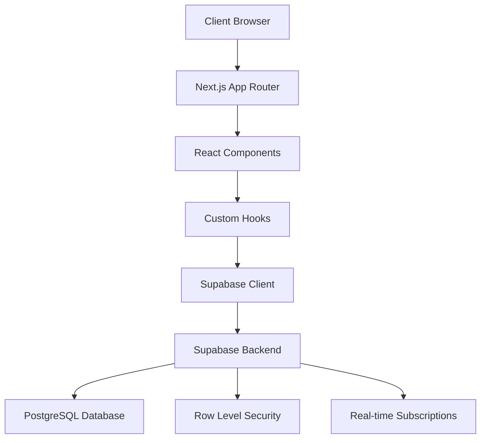

# Design Document

## Overview

The To-Do List application will be built as a modern web application using Next.js 14 with the App Router, TypeScript for type safety, and Supabase for backend services. The application follows a component-based architecture with clear separation of concerns between UI components, data access layers, and business logic.

### Technology Stack

- **Frontend Framework**: Next.js 14 (App Router)
- **Language**: TypeScript
- **Styling**: Tailwind CSS
- **UI Components**: shadcn/ui
- **Icons**: Lucide React
- **Backend**: Supabase (Database, Authentication, Real-time)
- **State Management**: React Context + useReducer for complex state
- **Form Handling**: React Hook Form with Zod validation
- **Date Handling**: date-fns

## Architecture

### High-Level Architecture



### Application Structure

```
src/
├── app/                    # Next.js App Router pages
│   ├── (auth)/            # Authentication routes
│   │   ├── login/
│   │   └── register/
│   ├── dashboard/         # Main application
│   ├── globals.css        # Global styles
│   └── layout.tsx         # Root layout
├── components/            # Reusable UI components
│   ├── ui/               # shadcn/ui components
│   ├── auth/             # Authentication components
│   ├── lists/            # List management components
│   ├── tasks/            # Task management components
│   └── layout/           # Layout components
├── lib/                  # Utility functions and configurations
│   ├── supabase/         # Supabase client and types
│   ├── utils.ts          # General utilities
│   └── validations.ts    # Zod schemas
├── hooks/                # Custom React hooks
├── types/                # TypeScript type definitions
└── contexts/             # React contexts
```

## Components and Interfaces

### Core Components

#### Authentication Components
- `LoginForm`: Handles user login with email/password
- `RegisterForm`: Handles user registration
- `AuthGuard`: Protects routes requiring authentication
- `AuthProvider`: Manages authentication state globally

#### List Management Components
- `ListCard`: Displays individual list with task count and actions
- `ListForm`: Form for creating/editing lists
- `ListGrid`: Grid layout for displaying multiple lists
- `DeleteListDialog`: Confirmation dialog for list deletion

#### Task Management Components
- `TaskItem`: Individual task display with checkbox, content, and actions
- `TaskForm`: Form for creating/editing tasks with due date and priority
- `TaskList`: Container for displaying filtered/sorted tasks
- `TaskFilters`: Filter controls for status, priority, and date
- `TaskSort`: Sort controls for various criteria

#### Layout Components
- `Header`: Application header with navigation and user menu
- `Sidebar`: Navigation sidebar (desktop)
- `MobileNav`: Mobile navigation drawer
- `LoadingSpinner`: Consistent loading indicator

### Data Interfaces

#### User Interface
```typescript
interface User {
  id: string;
  email: string;
  created_at: string;
  updated_at: string;
}
```

#### List Interface
```typescript
interface List {
  id: string;
  user_id: string;
  name: string;
  description?: string;
  created_at: string;
  updated_at: string;
  task_count?: number;
}
```

#### Task Interface
```typescript
interface Task {
  id: string;
  list_id: string;
  user_id: string;
  title: string;
  description?: string;
  completed: boolean;
  priority: 'low' | 'medium' | 'high';
  due_date?: string;
  created_at: string;
  updated_at: string;
}
```

#### Filter and Sort Interfaces
```typescript
interface TaskFilters {
  status?: 'all' | 'completed' | 'incomplete';
  priority?: 'low' | 'medium' | 'high' | 'all';
  overdue?: boolean;
}

interface TaskSort {
  field: 'created_at' | 'due_date' | 'priority' | 'title';
  direction: 'asc' | 'desc';
}
```

## Data Models

### Database Schema

#### Users Table (Managed by Supabase Auth)
```sql
-- Supabase handles user authentication
-- Additional user profile data can be stored in a profiles table if needed
```

#### Lists Table
```sql
CREATE TABLE lists (
  id UUID DEFAULT gen_random_uuid() PRIMARY KEY,
  user_id UUID REFERENCES auth.users(id) ON DELETE CASCADE,
  name TEXT NOT NULL,
  description TEXT,
  created_at TIMESTAMP WITH TIME ZONE DEFAULT NOW(),
  updated_at TIMESTAMP WITH TIME ZONE DEFAULT NOW()
);

-- RLS Policies
ALTER TABLE lists ENABLE ROW LEVEL SECURITY;

CREATE POLICY "Users can view their own lists" ON lists
  FOR SELECT USING (auth.uid() = user_id);

CREATE POLICY "Users can create their own lists" ON lists
  FOR INSERT WITH CHECK (auth.uid() = user_id);

CREATE POLICY "Users can update their own lists" ON lists
  FOR UPDATE USING (auth.uid() = user_id);

CREATE POLICY "Users can delete their own lists" ON lists
  FOR DELETE USING (auth.uid() = user_id);
```

#### Tasks Table
```sql
CREATE TABLE tasks (
  id UUID DEFAULT gen_random_uuid() PRIMARY KEY,
  list_id UUID REFERENCES lists(id) ON DELETE CASCADE,
  user_id UUID REFERENCES auth.users(id) ON DELETE CASCADE,
  title TEXT NOT NULL,
  description TEXT,
  completed BOOLEAN DEFAULT FALSE,
  priority TEXT CHECK (priority IN ('low', 'medium', 'high')) DEFAULT 'medium',
  due_date DATE,
  created_at TIMESTAMP WITH TIME ZONE DEFAULT NOW(),
  updated_at TIMESTAMP WITH TIME ZONE DEFAULT NOW()
);

-- RLS Policies
ALTER TABLE tasks ENABLE ROW LEVEL SECURITY;

CREATE POLICY "Users can view their own tasks" ON tasks
  FOR SELECT USING (auth.uid() = user_id);

CREATE POLICY "Users can create their own tasks" ON tasks
  FOR INSERT WITH CHECK (auth.uid() = user_id);

CREATE POLICY "Users can update their own tasks" ON tasks
  FOR UPDATE USING (auth.uid() = user_id);

CREATE POLICY "Users can delete their own tasks" ON tasks
  FOR DELETE USING (auth.uid() = user_id);
```

### Indexes for Performance
```sql
-- Indexes for better query performance
CREATE INDEX idx_lists_user_id ON lists(user_id);
CREATE INDEX idx_tasks_list_id ON tasks(list_id);
CREATE INDEX idx_tasks_user_id ON tasks(user_id);
CREATE INDEX idx_tasks_due_date ON tasks(due_date);
CREATE INDEX idx_tasks_priority ON tasks(priority);
CREATE INDEX idx_tasks_completed ON tasks(completed);
```

## Error Handling

### Error Types and Handling Strategy

#### Authentication Errors
- **Invalid Credentials**: Display user-friendly message, highlight form fields
- **Network Errors**: Show retry option with exponential backoff
- **Session Expiry**: Redirect to login with return URL

#### Validation Errors
- **Client-side**: Real-time validation with Zod schemas
- **Server-side**: Display specific field errors from Supabase
- **Form Submission**: Prevent submission until all errors resolved

#### Database Errors
- **Connection Issues**: Show offline indicator, queue operations
- **Constraint Violations**: User-friendly messages for unique constraints
- **Permission Errors**: Clear messaging about access restrictions

#### UI Error Boundaries
```typescript
interface ErrorBoundaryState {
  hasError: boolean;
  error?: Error;
}

// Global error boundary for unhandled errors
// Component-level error boundaries for specific features
```

### Error Recovery Strategies
- **Optimistic Updates**: Immediate UI feedback with rollback on failure
- **Retry Logic**: Automatic retry for transient network errors
- **Graceful Degradation**: Core functionality available even with partial failures
- **Error Reporting**: Log errors for debugging while maintaining user privacy

## Testing Strategy

### Unit Testing
- **Components**: Test rendering, user interactions, and prop handling
- **Hooks**: Test custom hooks with various scenarios
- **Utilities**: Test helper functions and validation schemas
- **Tools**: Jest, React Testing Library

### Integration Testing
- **API Integration**: Test Supabase client interactions
- **Form Workflows**: Test complete form submission flows
- **Authentication Flow**: Test login/logout/registration processes
- **Tools**: Jest, MSW for API mocking

### End-to-End Testing
- **User Journeys**: Test complete user workflows
- **Cross-browser**: Ensure compatibility across browsers
- **Responsive Design**: Test on various screen sizes
- **Tools**: Playwright or Cypress

### Performance Testing
- **Load Times**: Measure and optimize page load performance
- **Bundle Size**: Monitor and optimize JavaScript bundle size
- **Database Queries**: Optimize query performance and minimize N+1 queries

### Accessibility Testing
- **Screen Readers**: Test with assistive technologies
- **Keyboard Navigation**: Ensure full keyboard accessibility
- **Color Contrast**: Verify WCAG compliance
- **Tools**: axe-core, Lighthouse accessibility audit

### Testing Environment Setup
```typescript
// Test configuration for Supabase
const supabaseTest = createClient(
  process.env.NEXT_PUBLIC_SUPABASE_URL!,
  process.env.SUPABASE_SERVICE_ROLE_KEY!, // For test data setup
  { auth: { persistSession: false } }
);

// Mock data factories for consistent test data
const createMockUser = () => ({ ... });
const createMockList = () => ({ ... });
const createMockTask = () => ({ ... });
```

## Security Considerations

### Authentication Security
- **Password Requirements**: Minimum 8 characters, enforced by Supabase
- **Session Management**: Secure JWT tokens with appropriate expiration
- **CSRF Protection**: Built-in Next.js CSRF protection

### Data Security
- **Row Level Security**: Enforced at database level for all tables
- **Input Validation**: Client and server-side validation with Zod
- **SQL Injection Prevention**: Parameterized queries via Supabase client

### Frontend Security
- **XSS Prevention**: React's built-in XSS protection, sanitize user input
- **Content Security Policy**: Strict CSP headers
- **Environment Variables**: Secure handling of API keys and secrets

## Performance Optimization

### Frontend Performance
- **Code Splitting**: Automatic with Next.js App Router
- **Image Optimization**: Next.js Image component for optimized loading
- **Caching**: Aggressive caching of static assets and API responses
- **Bundle Analysis**: Regular bundle size monitoring

### Database Performance
- **Query Optimization**: Efficient queries with proper indexing
- **Connection Pooling**: Supabase handles connection management
- **Real-time Subscriptions**: Selective subscriptions to minimize overhead

### User Experience
- **Loading States**: Skeleton screens and loading indicators
- **Optimistic Updates**: Immediate UI feedback for better perceived performance
- **Progressive Enhancement**: Core functionality works without JavaScript